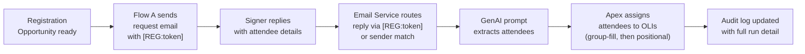

# Attendee Info Agent

Agentforce-driven automation for processing attendee registrations on Connect Meetings opportunities. When a registration opportunity is ready, the package emails the signer to collect attendee details, extracts them from the reply using a GenAI prompt, assigns them to the matching registration line items, and writes a full audit trail for every run.

## How It Works



## Core Components

| Component                                    | Type               | Purpose                                                                             |
| -------------------------------------------- | ------------------ | ----------------------------------------------------------------------------------- |
| `Appointment_Taker_Send_Registration_Emails` | Flow               | Sends outbound registration request with `[REG:<OppId>]` token in the subject       |
| `Event_Registration_Process_Attendee_Reply`  | Flow               | Processes inbound replies and orchestrates the full assignment run                  |
| `Extract_Attendee_Information`               | GenAI Prompt       | Extracts attendee names, emails, event names, and product types from replies        |
| `Opportunity_Creation`                       | GenAI Prompt       | Prompt template for opportunity creation workflows                                  |
| `ProcessAppointmentTakerAttendees`           | Invocable Apex     | Matches extracted attendees to open registration OLIs and writes assignment details |
| `AttendeeProcessingLogger`                   | Invocable Apex     | Creates the parent audit log record at the start of each run                        |
| `AttendeeProcessingLogUpdater`               | Invocable Apex     | Updates the parent log with AI response, counts, and final status                   |
| `AttendeeAssignmentDetailLogger`             | Invocable Apex     | Writes one child record per assignment attempt, skip, or failure                    |
| `AttendeeReplyEmailHandler`                  | Email Service Apex | Inbound email entry point — routes replies to the correct Opportunity thread        |
| `Attendee_Processing_Log__c`                 | Custom Object      | Parent audit record for a processing run                                            |
| `Attendee_Assignment_Detail__c`              | Custom Object      | Child audit record for an individual assignment attempt                             |
| `Attendee_Processing_with_Details`           | Report Type        | Joins processing logs to assignment details for operations reporting                |

## Key Design Details

- **Token-based routing:** Outbound emails include a `[REG:<OpportunityId>]` token in the subject. When the signer replies, the Email Service matches on the token for deterministic routing, with a legacy sender-based fallback for older emails without a token.
- **Domain-level matching:** Colleagues from the same email domain as the original recipient can reply on behalf of the signer.
- **Group-fill assignment:** Attendees are matched to OLIs by `event_name` + `product_type` first, then fall back to positional (next open slot in creation order).
- **Supported product types:** The assignment logic is scoped to three hardcoded Product2 IDs (Appointment Taker, Non-Appointment Taker, Marketer). If deploying to a new org, update `SUPPORTED_PRODUCT_IDS` in `ProcessAppointmentTakerAttendees.cls` with the correct IDs.
- **Security model:** SOQL queries use `USER_MODE` to enforce read security; DML updates use `SYSTEM_MODE` to bypass FLS on custom attendee fields for the automated process user.

## Repository Layout

```
force-app/main/default/
├── classes/
│   ├── AttendeeAssignmentDetailLogger.cls
│   ├── AttendeeProcessingLogger.cls
│   ├── AttendeeProcessingLogUpdater.cls
│   ├── AttendeeReplyEmailHandler.cls
│   ├── ProcessAppointmentTakerAttendees.cls
│   └── *Test.cls
├── flowDefinitions/
│   └── Event_Registration_Process_Attendee_Reply.flowDefinition-meta.xml
├── flows/
│   ├── Appointment_Taker_Send_Registration_Emails.flow-meta.xml
│   └── Event_Registration_Process_Attendee_Reply.flow-meta.xml
├── genAiPromptTemplates/
│   ├── Extract_Attendee_Information.genAiPromptTemplate-meta.xml
│   └── Opportunity_Creation.genAiPromptTemplate-meta.xml
├── objects/
│   ├── Attendee_Assignment_Detail__c/
│   └── Attendee_Processing_Log__c/
└── reportTypes/
    └── Attendee_Processing_with_Details.reportType-meta.xml
```

## Local Development

```bash
npm install
npm run lint
npm run prettier
```

## Deployment

Deploy the full package:

```bash
sf project deploy start -o <alias> \
  --metadata ApexClass:AttendeeAssignmentDetailLogger \
  --metadata ApexClass:AttendeeProcessingLogger \
  --metadata ApexClass:AttendeeProcessingLogUpdater \
  --metadata ApexClass:AttendeeReplyEmailHandler \
  --metadata ApexClass:ProcessAppointmentTakerAttendees \
  --metadata ApexClass:AttendeeProcessingLoggerTest \
  --metadata ApexClass:ProcessAppointmentTakerAttendeesTest \
  --metadata ApexClass:AttendeeReplyEmailHandlerTest \
  --metadata GenAiPromptTemplate:Extract_Attendee_Information \
  --metadata GenAiPromptTemplate:Opportunity_Creation \
  --metadata CustomObject:Attendee_Processing_Log__c \
  --metadata CustomObject:Attendee_Assignment_Detail__c \
  --metadata ReportType:Attendee_Processing_with_Details \
  --metadata Flow:Event_Registration_Process_Attendee_Reply \
  --test-level RunSpecifiedTests \
  --tests AttendeeProcessingLoggerTest \
  --tests ProcessAppointmentTakerAttendeesTest \
  --tests AttendeeReplyEmailHandlerTest
```

Activate the reply flow after deployment:

```bash
sf project deploy start -o <alias> \
  --metadata FlowDefinition:Event_Registration_Process_Attendee_Reply \
  --test-level RunSpecifiedTests \
  --tests AttendeeProcessingLoggerTest \
  --tests ProcessAppointmentTakerAttendeesTest \
  --tests AttendeeReplyEmailHandlerTest
```

> **Note:** After deploying, ensure `Connect System Administrator` and any operations/support profiles have read and edit access to the audit fields on `Attendee_Processing_Log__c` and `Attendee_Assignment_Detail__c`.

> **Note:** The `SUPPORTED_PRODUCT_IDS` set in `ProcessAppointmentTakerAttendees.cls` contains org-specific Product2 IDs. Update these when deploying to a different org.
