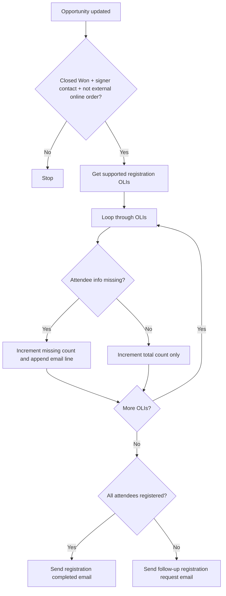
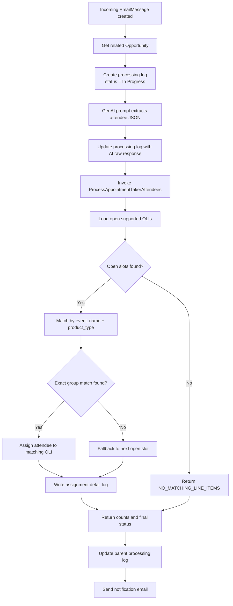
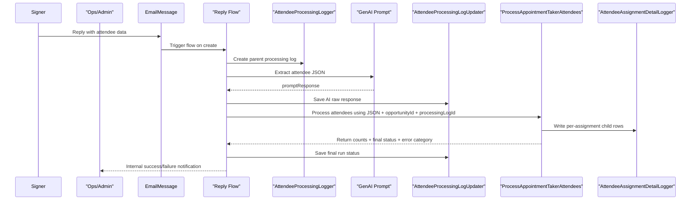
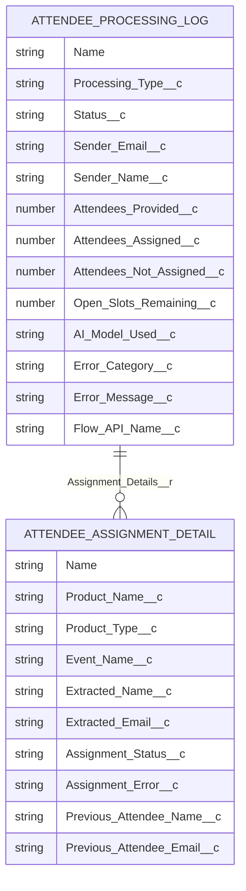

# Attendee Info Agent

Agentforce-driven attendee registration automation for Connect Meetings opportunities. The package combines two Salesforce flows, a GenAI prompt, Apex assignment logic, and a new audit logging model so the team can request attendee details, process inbound replies, and trace every processing run.

## What Changed

This repository now includes a full attendee processing audit trail and a flow-wired inbound reply workflow:

- Added `Attendee_Processing_Log__c` as the parent audit record for each workflow run.
- Added `Attendee_Assignment_Detail__c` as the child audit record for each attendee assignment attempt.
- Added invocable logging Apex:
  - `AttendeeProcessingLogger`
  - `AttendeeProcessingLogUpdater`
  - `AttendeeAssignmentDetailLogger`
- Updated `ProcessAppointmentTakerAttendees` to:
  - accept a `processingLogId`
  - return counts and final processing status
  - create assignment detail records for assigned, skipped, and failed attempts
- Updated `Event_Registration_Process_Attendee_Reply` so it now:
  - creates a processing log at the start
  - stores the AI response after extraction
  - updates the processing log with final counts and status
  - writes per-assignment details through Apex
- Added `Attendee_Processing_with_Details` report type for audit reporting.
- Added `flowDefinitions/Event_Registration_Process_Attendee_Reply.flowDefinition-meta.xml` so the deployed reply flow can be activated in source-controlled deployments.
- Deployed the package to the `connectmeetings` org and activated reply flow version 4.
- Granted field-level access for the audit fields to the `Connect System Administrator` profile in the validation org.

## End-to-End Architecture

```mermaid
flowchart LR
    A["Opportunity closes won"] --> B["Flow A<br/>Appointment Taker - Send Registration Emails"]
    B --> C["Outbound email to signer<br/>with REG token and registration lines"]
    C --> D["Signer replies with attendee details"]
    D --> E["EmailMessage created<br/>or inserted by email service"]
    E --> F["Flow B<br/>Event Registration - Process Attendee Reply"]
    F --> G["Create audit log<br/>Attendee_Processing_Log__c"]
    G --> H["GenAI prompt extracts attendees"]
    H --> I["Update audit log<br/>with AI response"]
    I --> J["Apex assigns attendees to OLIs"]
    J --> K["Create assignment details<br/>Attendee_Assignment_Detail__c"]
    J --> L["Update parent log<br/>with counts and final status"]
    L --> M["Success or failure notification email"]
    L --> N["Report type and list views<br/>for operations and audit review"]
```



## Core Components

| Component                                                                                                    | Type               | Purpose                                                                                       |
| ------------------------------------------------------------------------------------------------------------ | ------------------ | --------------------------------------------------------------------------------------------- |
| `force-app/main/default/flows/Appointment_Taker_Send_Registration_Emails.flow-meta.xml`                      | Flow               | Sends the outbound registration request email after `Closed Won`.                             |
| `force-app/main/default/flows/Event_Registration_Process_Attendee_Reply.flow-meta.xml`                       | Flow               | Processes inbound attendee replies, extracts attendees, updates OLIs, and updates audit logs. |
| `force-app/main/default/flowDefinitions/Event_Registration_Process_Attendee_Reply.flowDefinition-meta.xml`   | FlowDefinition     | Activates reply flow version 4 during deployment.                                             |
| `force-app/main/default/classes/ProcessAppointmentTakerAttendees.cls`                                        | Invocable Apex     | Matches extracted attendees to supported registration OLIs and writes assignment details.     |
| `force-app/main/default/classes/AttendeeProcessingLogger.cls`                                                | Invocable Apex     | Creates the parent processing log record.                                                     |
| `force-app/main/default/classes/AttendeeProcessingLogUpdater.cls`                                            | Invocable Apex     | Updates the parent processing log during and after processing.                                |
| `force-app/main/default/classes/AttendeeAssignmentDetailLogger.cls`                                          | Invocable Apex     | Creates child assignment detail records.                                                      |
| `force-app/main/default/classes/AttendeeReplyEmailHandler.cls`                                               | Email Service Apex | Optional inbound email entrypoint that inserts an `EmailMessage` linked to the opportunity.   |
| `force-app/main/default/genAiPromptTemplates/Extract_Attendee_Information.genAiPromptTemplate-meta.xml`      | GenAI Prompt       | Extracts attendee names, emails, event names, and product types from replies.                 |
| `force-app/main/default/objects/Attendee_Processing_Log__c/Attendee_Processing_Log__c.object-meta.xml`       | Custom Object      | Parent audit record for a processing run.                                                     |
| `force-app/main/default/objects/Attendee_Assignment_Detail__c/Attendee_Assignment_Detail__c.object-meta.xml` | Custom Object      | Child audit record for an individual assignment attempt.                                      |
| `force-app/main/default/reportTypes/Attendee_Processing_with_Details.reportType-meta.xml`                    | Report Type        | Reporting layer for processing logs with assignment details.                                  |

## Workflow A: Outbound Registration Request

### Purpose

Send the signer a structured follow-up email listing the event registrations that still need attendee details.

### Trigger Conditions

`Appointment_Taker_Send_Registration_Emails` starts when:

- the opportunity stage becomes `Closed Won`
- `Signer_Contact__c` is populated
- `External_Online_Order__c = false`

The flow then queries supported registration products only:

- Appointment Taker: `01t4X000004U13iQAC`
- Non-Appointment Taker: `01t4X000004U14AQAS`
- Marketer: `01t4X000004U148QAC`

### How It Works

1. The flow retrieves supported opportunity line items for the opportunity.
2. It loops through those OLIs and checks whether attendee information is missing.
3. It counts total registrations and missing registrations.
4. It builds the outbound email body line by line using:
   - event name
   - registration type
   - product type
5. If all supported registrations already have attendee data, it sends a completion-style email.
6. If any supported registrations are missing attendee data, it sends a follow-up request email to the signer contact.

### Workflow Diagram



## Workflow B: Inbound Reply Processing and Assignment

### Purpose

Take an inbound reply email, extract attendee details with AI, assign attendees to supported registration OLIs, and write a full audit trail for the run.

### Trigger Conditions

`Event_Registration_Process_Attendee_Reply` starts when:

- `EmailMessage.Incoming = true`
- `EmailMessage.Subject` contains `Action Required: Attendee Details for your Event Registrations`

### How It Works

1. The flow retrieves the related opportunity from `EmailMessage.RelatedToId`.
2. It creates a parent processing log through `AttendeeProcessingLogger`.
3. It sends the full inbound `EmailMessage` to the `Extract_Attendee_Information` GenAI prompt.
4. It writes the raw AI response back to the processing log through `AttendeeProcessingLogUpdater`.
5. It invokes `ProcessAppointmentTakerAttendees` with:
   - the extracted JSON
   - the opportunity id
   - the processing log id
6. Apex loads open supported registration OLIs and attempts to match attendees in this order:
   - first by `event_name + product_type`
   - then by next available open slot in creation order
7. Apex matches attendee emails to existing contacts on the opportunity account and populates `Event_Attendee_Contact__c` when possible.
8. Apex writes one child assignment detail row per assignment attempt, skip, or failure.
9. The flow updates the parent processing log with:
   - attendees provided
   - attendees assigned
   - attendees not assigned
   - open slots remaining
   - final status
   - error category
10. The flow sends a success or failure notification email.

### Current Matching Rules

`ProcessAppointmentTakerAttendees` currently treats a supported OLI as available only when:

- `Attendee_Name__c = null`
- `Attendee_Email__c = null`

That means an OLI with an email already present is treated as unavailable, even if the attendee name is still blank.

### Workflow Diagram



### Sequence Diagram



## Audit Logging Model

### Purpose

The new audit model makes each run observable at two levels:

- parent log = one workflow execution
- child detail = one attendee assignment attempt

### Data Model Diagram



### Parent Log Contents

`Attendee_Processing_Log__c` captures the run summary:

- opportunity
- processing type
- status
- inbound or outgoing email references
- sender details
- AI prompt / raw response / model
- counts for provided, assigned, not assigned, and open slots remaining
- error message and error category
- flow API name and flow interview context

### Child Detail Contents

`Attendee_Assignment_Detail__c` captures the per-attendee action:

- OLI reference
- product name, product type, and event name
- extracted attendee name/email/phone
- assigned contact
- assignment status
- assignment error
- previous attendee values before overwrite

### Reporting Layer

The report type `Attendee_Processing_with_Details` joins processing logs to assignment details so operations can report on:

- total runs
- success and failure rates
- partial successes
- skipped attendees
- assignment errors
- specific attendee-to-product decisions

## Inbound Email Service Path

`AttendeeReplyEmailHandler` supports an email-service entrypoint for attendee replies. It:

1. checks for the registration subject pattern
2. extracts the `[REG:<OpportunityId>]` token from the subject when present
3. matches the original outgoing email by token and sender
4. prepares a prompt-safe plain text body
5. inserts an inbound `EmailMessage` linked to the opportunity
6. lets `Event_Registration_Process_Attendee_Reply` handle the rest

This class is useful when replies need to be routed through an email service address rather than relying on standard Salesforce email threading alone.

## Repository Layout

```text
force-app/main/default/
├── classes/
│   ├── AttendeeAssignmentDetailLogger.cls
│   ├── AttendeeProcessingLogger.cls
│   ├── AttendeeProcessingLogUpdater.cls
│   ├── AttendeeReplyEmailHandler.cls
│   ├── ProcessAppointmentTakerAttendees.cls
│   └── *Test.cls
├── flowDefinitions/
│   └── Event_Registration_Process_Attendee_Reply.flowDefinition-meta.xml
├── flows/
│   ├── Appointment_Taker_Send_Registration_Emails.flow-meta.xml
│   └── Event_Registration_Process_Attendee_Reply.flow-meta.xml
├── genAiPromptTemplates/
│   └── Extract_Attendee_Information.genAiPromptTemplate-meta.xml
├── objects/
│   ├── Attendee_Assignment_Detail__c/
│   └── Attendee_Processing_Log__c/
└── reportTypes/
    └── Attendee_Processing_with_Details.reportType-meta.xml
```

## Deployment and Validation Summary

### Deployed and Verified

- Reply flow metadata deployed and activated in the target org.
- `Event_Registration_Process_Attendee_Reply` is active on version 4.
- Audit objects and invocable logging classes were deployed.
- `ProcessAppointmentTakerAttendees` and its tests were updated and deployed.
- A production smoke test created, updated, queried, and deleted:
  - one `Attendee_Processing_Log__c`
  - one `Attendee_Assignment_Detail__c`

### Production Validation Performed

- `19/19` specified Apex tests passed during deployment.
- Live smoke test passed for:
  - parent log creation
  - parent log update
  - child detail creation
  - SOQL visibility
  - cleanup

### Important Deployment Note

The audit fields required field-level security updates in the validation org. For future deployments, make sure operational profiles and permission sets can read and edit the new audit fields, especially:

- `Connect System Administrator`
- any support or operations users who need to review logs and reports

## Current Validation Notes

The repository now documents the deployed behavior accurately, including current edge cases found during live testing:

- Opportunities with no open supported registration OLIs correctly return `NO_MATCHING_LINE_ITEMS`.
- Opportunities that are already fully populated also return `NO_MATCHING_LINE_ITEMS` under the current logic because the processor only assigns into empty slots.
- The current reply flow decision is keyed on `varIsSuccess`, while some no-slot branches in `ProcessAppointmentTakerAttendees` return:
  - `isSuccess = true`
  - `finalStatus = Failed`

That means some no-slot cases can still take the success email path even though the processing log records a failed final status. This is a known logic gap and should be corrected in a future update.

## Local Development

```bash
npm install
npm run lint
npm run prettier
```

## Deployment Commands

Deploy the workflow and audit package:

```bash
sf project deploy start -o <alias> \
  --metadata ApexClass:AttendeeAssignmentDetailLogger \
  --metadata ApexClass:AttendeeProcessingLogger \
  --metadata ApexClass:AttendeeProcessingLogUpdater \
  --metadata ApexClass:ProcessAppointmentTakerAttendees \
  --metadata ApexClass:AttendeeProcessingLoggerTest \
  --metadata ApexClass:ProcessAppointmentTakerAttendeesTest \
  --metadata CustomObject:Attendee_Processing_Log__c \
  --metadata CustomObject:Attendee_Assignment_Detail__c \
  --metadata ReportType:Attendee_Processing_with_Details \
  --metadata Flow:Event_Registration_Process_Attendee_Reply \
  --test-level RunSpecifiedTests \
  --tests AttendeeProcessingLoggerTest \
  --tests ProcessAppointmentTakerAttendeesTest
```

Activate the deployed reply flow version:

```bash
sf project deploy start -o <alias> \
  --metadata FlowDefinition:Event_Registration_Process_Attendee_Reply \
  --test-level RunSpecifiedTests \
  --tests AttendeeProcessingLoggerTest \
  --tests ProcessAppointmentTakerAttendeesTest
```

## Related Documentation

- `DEPLOYMENT_AND_FLOW_INTEGRATION_GUIDE.md`
- `salesforce-visit-sync_session-2026-02-11.md`
