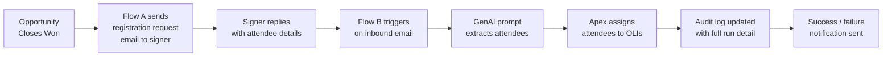

# Attendee Info Agent

Agentforce-driven automation for processing attendee registrations on Connect Meetings opportunities. When an opportunity closes, the package requests attendee details from the signer, extracts them from the reply using a GenAI prompt, assigns them to the matching registration line items, and writes a full audit trail for every run.

## How It Works



## Core Components

| Component                                    | Type               | Purpose                                                                             |
| -------------------------------------------- | ------------------ | ----------------------------------------------------------------------------------- |
| `Appointment_Taker_Send_Registration_Emails` | Flow               | Sends outbound registration request after Closed Won                                |
| `Event_Registration_Process_Attendee_Reply`  | Flow               | Processes inbound replies and orchestrates the full assignment run                  |
| `Extract_Attendee_Information`               | GenAI Prompt       | Extracts attendee names, emails, event names, and product types from replies        |
| `ProcessAppointmentTakerAttendees`           | Invocable Apex     | Matches extracted attendees to open registration OLIs and writes assignment details |
| `AttendeeProcessingLogger`                   | Invocable Apex     | Creates the parent audit log record at the start of each run                        |
| `AttendeeProcessingLogUpdater`               | Invocable Apex     | Updates the parent log with AI response, counts, and final status                   |
| `AttendeeAssignmentDetailLogger`             | Invocable Apex     | Writes one child record per assignment attempt, skip, or failure                    |
| `AttendeeReplyEmailHandler`                  | Email Service Apex | Optional inbound email entry point for routing replies via an email service address |
| `Attendee_Processing_Log__c`                 | Custom Object      | Parent audit record for a processing run                                            |
| `Attendee_Assignment_Detail__c`              | Custom Object      | Child audit record for an individual assignment attempt                             |
| `Attendee_Processing_with_Details`           | Report Type        | Joins processing logs to assignment details for operations reporting                |

## Repository Layout

```
force-app/main/default/
├── classes/
│   ├── AttendeeAssignmentDetailLogger.cls
│   ├── AttendeeProcessingLogger.cls
│   ├── AttendeeProcessingLogUpdater.cls
│   ├── AttendeeReplyEmailHandler.cls
│   ├── ProcessAppointmentTakerAttendees.cls
│   └── *Test.cls
├── flowDefinitions/
│   └── Event_Registration_Process_Attendee_Reply.flowDefinition-meta.xml
├── flows/
│   ├── Appointment_Taker_Send_Registration_Emails.flow-meta.xml
│   └── Event_Registration_Process_Attendee_Reply.flow-meta.xml
├── genAiPromptTemplates/
│   └── Extract_Attendee_Information.genAiPromptTemplate-meta.xml
├── objects/
│   ├── Attendee_Assignment_Detail__c/
│   └── Attendee_Processing_Log__c/
└── reportTypes/
    └── Attendee_Processing_with_Details.reportType-meta.xml
```

## Local Development

```bash
npm install
npm run lint
npm run prettier
```

## Deployment

Deploy the full package:

```bash
sf project deploy start -o <alias> \
  --metadata ApexClass:AttendeeAssignmentDetailLogger \
  --metadata ApexClass:AttendeeProcessingLogger \
  --metadata ApexClass:AttendeeProcessingLogUpdater \
  --metadata ApexClass:ProcessAppointmentTakerAttendees \
  --metadata ApexClass:AttendeeProcessingLoggerTest \
  --metadata ApexClass:ProcessAppointmentTakerAttendeesTest \
  --metadata CustomObject:Attendee_Processing_Log__c \
  --metadata CustomObject:Attendee_Assignment_Detail__c \
  --metadata ReportType:Attendee_Processing_with_Details \
  --metadata Flow:Event_Registration_Process_Attendee_Reply \
  --test-level RunSpecifiedTests \
  --tests AttendeeProcessingLoggerTest \
  --tests ProcessAppointmentTakerAttendeesTest
```

Activate the reply flow after deployment:

```bash
sf project deploy start -o <alias> \
  --metadata FlowDefinition:Event_Registration_Process_Attendee_Reply \
  --test-level RunSpecifiedTests \
  --tests AttendeeProcessingLoggerTest \
  --tests ProcessAppointmentTakerAttendeesTest
```

> **Note:** After deploying, ensure `Connect System Administrator` and any operations/support profiles have read and edit access to the audit fields on `Attendee_Processing_Log__c` and `Attendee_Assignment_Detail__c`.

## Documentation

Detailed architecture, workflow diagrams, and audit model docs are in [`docs/`](./docs/).
