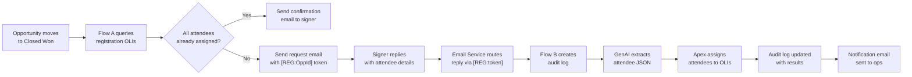
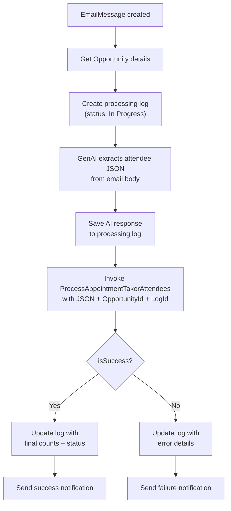
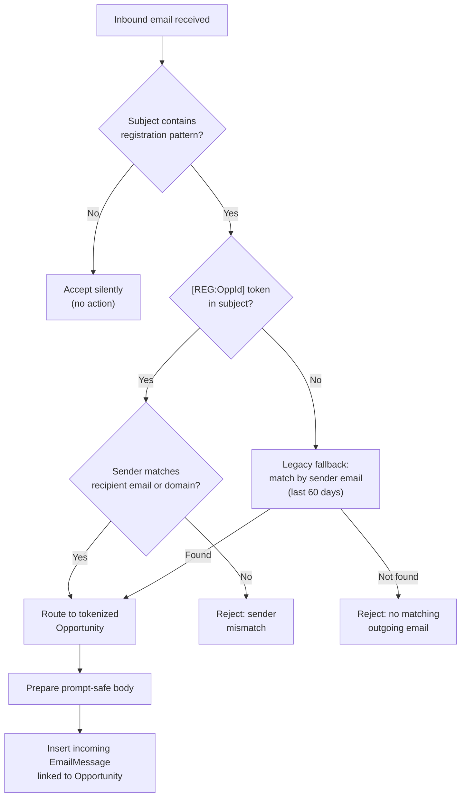
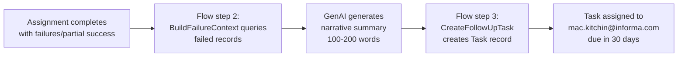
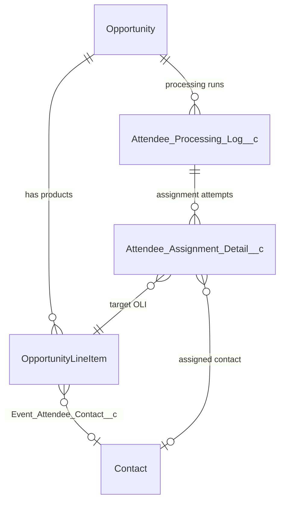

# Attendee Info Agent

Automation for collecting and assigning event attendee details on Connect Meetings opportunities. This Salesforce DX package uses two record-triggered flows, a GenAI prompt template, and invocable Apex to:

- Email signers for missing attendee information
- Use GenAI to extract structured attendee data from freeform replies
- Assign attendees to the correct registration `OpportunityLineItem` records
- Maintain a detailed audit trail of every processing run

## Table of Contents

- [End-to-End Flow](#end-to-end-flow)
- [Workflow A: Outbound Registration Request](#workflow-a-outbound-registration-request)
- [Workflow B: Inbound Reply Processing](#workflow-b-inbound-reply-processing)
- [Inbound Email Routing](#inbound-email-routing)
- [Attendee Assignment Logic](#attendee-assignment-logic)
- [AI Extraction](#ai-extraction)
- [Audit Logging Model](#audit-logging-model)
- [Failure Follow-Up Task Pipeline](#failure-follow-up-task-pipeline)
- [Component Reference](#component-reference)
- [Data Model](#data-model)
- [Repository Layout](#repository-layout)
- [Local Development](#local-development)
- [Deployment](#deployment)
- [Org-Specific Configuration](#org-specific-configuration)

## End-to-End Flow



## Workflow A: Outbound Registration Request

**Flow:** `Appointment_Taker_Send_Registration_Emails`

### Trigger Conditions

The flow fires on Opportunity update when all three conditions are met:

| Condition           | Field                      | Value        |
| ------------------- | -------------------------- | ------------ |
| Stage changed to    | `StageName`                | `Closed Won` |
| Signer populated    | `Signer_Contact__c`        | not null     |
| Not an online order | `External_Online_Order__c` | `false`      |

### What It Does

1. Queries all OpportunityLineItems for the three supported registration products (Appointment Taker, Non-Appointment Taker, Marketer).
2. Loops through each OLI and checks whether `Attendee_Name__c` or `Attendee_Email__c` is missing.
3. For each missing slot, appends a numbered line to the email body:
   ```
   1. Event: BizBash MEGA | Registration Type: Appointment Taker | Type: Association
   Attendee Name:
   Attendee Email:
   ```
4. If all registrations already have attendee data, sends a confirmation email instead.
5. If any are missing, sends the follow-up request email to `Signer_Contact__r.Email`.

### Email Details

| Field     | Value                                                                                  |
| --------- | -------------------------------------------------------------------------------------- |
| Sender    | `attendeeinfo@informa.com` (Org-Wide Email Address)                                    |
| Subject   | `Action Required: Attendee Details for your Event Registrations [REG:<OpportunityId>]` |
| Recipient | `Signer_Contact__r.Email`                                                              |
| Logged    | Yes (`logEmailOnSend = true`)                                                          |

The `[REG:<OpportunityId>]` token in the subject enables deterministic routing when the signer replies.

## Workflow B: Inbound Reply Processing

**Flow:** `Event_Registration_Process_Attendee_Reply`

### Trigger Conditions

Fires on `EmailMessage` create when:

- `Incoming = true`
- `Subject` contains `Action Required: Attendee Details for your Event Registrations`

### Processing Steps



### Fault Handling

Any exception at steps C through F is caught by a fault connector that:

1. Captures `$Flow.FaultMessage` into `varStatusMessage`
2. Updates the processing log with `status = Failed` and `errorCategory = Flow Error`
3. Sends a failure notification email

### Notification Emails

Sent to `mac.kitchin@informa.com` from `attendeeinfo@informa.com`:

- **Success:** `[Attendee Reply][SUCCESS] <original subject>`
- **Failure:** `[Attendee Reply][FAILED] <original subject>`

Both include Account name, Opportunity name, sender details, and the status message.

## Inbound Email Routing

**Class:** `AttendeeReplyEmailHandler` (implements `Messaging.InboundEmailHandler`)

This Email Service class receives forwarded replies and routes them to the correct Opportunity thread before Flow B fires.

### Routing Logic



### Key Behaviors

- **Token-based routing (preferred):** Extracts the Opportunity ID from `[REG:<Id>]` in the subject line. Validates that the sender's email or domain matches the original outgoing email recipient.
- **Domain-level matching:** A colleague from the same email domain as the original recipient can reply on behalf of the signer.
- **Legacy fallback:** For older emails without a `[REG:]` token, searches the last 60 days of outgoing emails matching the registration subject pattern and sender address.
- **Prompt body preparation:** Strips Outlook quoted reply content (`________________________________` separator), but preserves quoted content when the top reply contains a deferral phrase like "please see below." Decodes HTML entities (`&amp;`, `&#124;`, etc.) and caps body length at 28,000 characters.

## Attendee Assignment Logic

**Class:** `ProcessAppointmentTakerAttendees` (Invocable Apex)

### Supported Products

Assignment is scoped to three Product2 records by ID:

| Product Name          | Product2 ID          |
| --------------------- | -------------------- |
| Appointment Taker     | `01t4X000004U13iQAC` |
| Non-Appointment Taker | `01t4X000004U14AQAS` |
| Marketer              | `01t4X000004U148QAC` |

### Slot Availability

An OLI is considered an open slot only when both `Attendee_Name__c` and `Attendee_Email__c` are null.

### Assignment Strategy

For each attendee extracted from the JSON:

1. **Group-fill match:** Try to find an unclaimed OLI where `Event_Name__c` + `Product_Type__c` matches the attendee's `event_name` + `product_type` (case-insensitive).
2. **Positional fallback:** If no group match, assign to the next available open slot in `CreatedDate ASC` order.
3. **Contact resolution:** If the attendee's email matches a Contact on the Opportunity's Account, populate `Event_Attendee_Contact__c` with that Contact ID.

### OLI Fields Updated

| Field                       | Value                         |
| --------------------------- | ----------------------------- |
| `Attendee_First_Name__c`    | Extracted first name          |
| `Attendee_Name__c`          | `first_name` + `last_name`    |
| `Attendee_Email__c`         | Extracted email               |
| `Event_Attendee_Contact__c` | Matched Contact ID (if found) |

### Security Model

- **Reads:** `USER_MODE` -- enforces the running user's object and field permissions on all SOQL queries.
- **Writes:** `SYSTEM_MODE` -- bypasses FLS so the automated process user can write to custom attendee fields without explicit field-level grants.

### Result Statuses

| Status            | Condition                                                      |
| ----------------- | -------------------------------------------------------------- |
| `Success`         | All provided attendees were assigned                           |
| `Partial Success` | Some attendees assigned, some skipped or failed                |
| `Failed`          | No attendees could be assigned, or a processing error occurred |

### Error Categories

`None`, `JSON Parse`, `AI Extraction`, `Validation`, `DML`, `Other`, `Flow Error`

## AI Extraction

**Prompt Template:** `Extract_Attendee_Information`

### Active Version (v4)

- **Model:** Claude 4.5 Haiku (`sfdc_ai__DefaultBedrockAnthropicClaude45Haiku`)
- **Input:** `EmailMessage` record (Subject + TextBody)
- **Output:** Raw JSON array

### Prompt Behavior

The prompt handles two reply formats:

1. **Structured replies** where the signer fills in the template:

   ```
   Event: BizBash MEGA | Type: Association
   Attendee Name: Jane Doe
   Attendee Email: jane@company.com
   ```

   Extracts: `event_name`, `product_type`, `first_name`, `last_name`, `email`

2. **Unstructured replies** where the signer writes freeform text:
   Extracts names and emails where identifiable, leaving `event_name` and `product_type` as empty strings.

### Expected Output Format

```json
[
  {
    "event_name": "BizBash MEGA",
    "product_type": "Association",
    "first_name": "Jane",
    "last_name": "Doe",
    "email": "jane@company.com"
  }
]
```

### Other Prompt Templates

| Template               | Model | Status | Purpose                                                             |
| ---------------------- | ----- | ------ | ------------------------------------------------------------------- |
| `Opportunity_Creation` | GPT-5 | Draft  | Creates Opportunity records from unstructured text (not yet active) |

## Audit Logging Model

Every processing run is tracked at two levels:

### Parent: `Attendee_Processing_Log__c` (APL-00001)

Created at the start of each run, updated after AI extraction and after assignment.

| Field                                         | Description                                                 |
| --------------------------------------------- | ----------------------------------------------------------- |
| `Opportunity__c`                              | Related Opportunity                                         |
| `Processing_Type__c`                          | `Inbound Reply`, `Outbound Email`, or `Manual Reprocess`    |
| `Status__c`                                   | `In Progress` then `Success` / `Partial Success` / `Failed` |
| `Processing_Date__c`                          | Timestamp of run start                                      |
| `Email_Message_Id__c`                         | Inbound EmailMessage ID                                     |
| `Outgoing_Email_Id__c`                        | Original outgoing EmailMessage ID                           |
| `Sender_Email__c` / `Sender_Name__c`          | Reply sender details                                        |
| `Total_Registration_Products__c`              | Count of supported OLIs on the Opportunity                  |
| `Attendees_Provided__c`                       | Count extracted by AI                                       |
| `Attendees_Assigned__c`                       | Count successfully written to OLIs                          |
| `Attendees_Not_Assigned__c`                   | Count that could not be assigned                            |
| `Open_Slots_Remaining__c`                     | Empty OLI slots after assignment                            |
| `AI_Prompt_Input__c`                          | Email body sent to the prompt                               |
| `AI_Raw_Response__c`                          | Raw JSON returned by the AI model                           |
| `AI_Model_Used__c`                            | Model identifier                                            |
| `Error_Message__c` / `Error_Category__c`      | Error details if failed                                     |
| `Flow_API_Name__c` / `Flow_Interview_GUID__c` | Flow execution context                                      |

### Child: `Attendee_Assignment_Detail__c` (AAD-00001)

One record per attendee assignment attempt. Sharing is controlled by the parent (`ControlledByParent`).

| Field                                                                              | Description                        |
| ---------------------------------------------------------------------------------- | ---------------------------------- |
| `Processing_Log__c`                                                                | Parent log reference               |
| `Opportunity_Product__c`                                                           | Target OLI                         |
| `Product_Name__c` / `Product_Type__c` / `Event_Name__c`                            | OLI context                        |
| `Extracted_Name__c` / `Extracted_Email__c` / `Extracted_Phone__c`                  | AI-extracted attendee data         |
| `Assigned_Contact__c`                                                              | Matched Contact record             |
| `Assignment_Status__c`                                                             | `Assigned`, `Failed`, or `Skipped` |
| `Assignment_Error__c`                                                              | Error message if failed            |
| `Previous_Attendee_Name__c` / `Previous_Attendee_Email__c` / `Previous_Contact__c` | Before-state for audit trail       |

### Invocable Classes

| Class                            | Flow Action Label              | Purpose                                         |
| -------------------------------- | ------------------------------ | ----------------------------------------------- |
| `AttendeeProcessingLogger`       | Create Attendee Processing Log | Insert parent log at run start                  |
| `AttendeeProcessingLogUpdater`   | Update Attendee Processing Log | Update parent log after AI and after assignment |
| `AttendeeAssignmentDetailLogger` | Log Attendee Assignment Detail | Insert child detail per OLI attempt             |

### List Views

| View                        | Filter                                |
| --------------------------- | ------------------------------------- |
| All Processing Logs         | All records                           |
| Failed Processing Runs      | `Status__c = Failed`                  |
| Inbound Reply Logs          | `Processing_Type__c = Inbound Reply`  |
| Outbound Email Logs         | `Processing_Type__c = Outbound Email` |
| Today's Processing Activity | `Processing_Date__c = TODAY`          |

### Reporting

The `Attendee_Processing_with_Details` report type joins `Attendee_Processing_Log__c` to `Attendee_Assignment_Detail__c` (outer join) for operations reporting on success rates, error patterns, and individual assignment decisions.

## Failure Follow-Up Task Pipeline

When attendee assignment encounters failures or partial success, an automated three-step pipeline creates a follow-up task for operators to review and resolve issues.

### Pipeline Overview



### Step 1: BuildFailureContext

**Class:** `BuildFailureContext` (Invocable Apex)

Queries `Attendee_Assignment_Detail__c` records and formats a context block for AI prompt input.

**Inputs:**

| Parameter | Type | Description |
| --- | --- | --- |
| `processingLogId` | String | ID of the `Attendee_Processing_Log__c` record (may be blank) |
| `statusMessage` | String | Overall status message from the processing run |
| `opportunityName` | String | Name of the Opportunity being processed |

**Output:**

| Parameter | Type | Description |
| --- | --- | --- |
| `formattedContext` | String | Formatted narrative containing assigned and failed attendees with details, up to 10,000 characters |

**Behavior:**
- Queries all `Attendee_Assignment_Detail__c` records for the processing log
- Groups records into two sections: "ASSIGNED ATTENDEES" and "FAILED / SKIPPED ATTENDEES"
- Each attendee line includes: name, email, event name, product type, and error reason (if failed)
- Truncates intelligently when exceeding 10,000 characters: removes entries from failed section first, then assigned section, preserving headers and at least one entry per section
- Falls back to minimal context if no log ID provided or no records found

**Security:** Runs with `SYSTEM_MODE` to ensure all users (triggered by Flow automation) can read all assignment detail records regardless of role-based sharing.

### Step 2: Attendee Assignment Failure Summary

**Template:** `Attendee_Assignment_Failure_Summary` (GenAI Prompt Template)

Generates a concise, plain-English narrative summarizing the failure context for a Task description.

**Configuration:**

| Setting | Value |
| --- | --- |
| Model | Claude 3.5 Haiku on Bedrock |
| Word Count | 100–200 words |
| Format | Plain prose with optional plain dashes (-) for lists; no markdown |

**Inputs:**
- Formatted context from BuildFailureContext

**Output:**
- Plain-text narrative suitable for Task description, including:
  - Summary of which attendees were successfully assigned
  - Details of what failed (missing data, system errors, duplicates, etc.)
  - Recommended next steps for the operator (manual matching, contact signer, etc.)

### Step 3: CreateFollowUpTask

**Class:** `CreateFollowUpTask` (Invocable Apex)

Creates a Salesforce Task on the Opportunity with the AI-generated summary for operator review.

**Inputs:**

| Parameter | Type | Required | Description |
| --- | --- | --- | --- |
| `opportunityId` | Id | Yes | The Opportunity to attach the Task to |
| `opportunityName` | String | Yes | Used in the Task subject, truncated to 200 characters |
| `aiSummary` | String | No | AI-generated narrative for the Task description |
| `statusMessage` | String | No | Fallback for Task description if aiSummary is blank |

**Output:**

| Parameter | Type | Description |
| --- | --- | --- |
| `success` | Boolean | Whether the Task was created successfully |
| `taskId` | Id | ID of the created Task (if successful) |
| `errorMessage` | String | Error details if the operation failed |

**Task Details:**

| Field | Value |
| --- | --- |
| Subject | `Review Attendee Assignment Failures — <opportunityName>` (opportunityName truncated to 200 chars) |
| WhatId | The Opportunity record |
| OwnerId | `mac.kitchin@informa.com` (or running user if that account is inactive) |
| ActivityDate | 30 days from today |
| Status | Not Started |
| Priority | Normal |
| Type | Other |
| Description | AI summary (or fallback status message if summary unavailable) |

**Security:** Uses `insert as system` to ensure the Task is created regardless of current user permissions.

**Owner Resolution:**
- Queries for the User with email `mac.kitchin@informa.com` and `IsActive = TRUE` using `SYSTEM_MODE`
- If found, assigns the Task to that user
- If not found or inactive, logs a WARN message and assigns to the running user (`UserInfo.getUserId()`)

### Integration with Flow

The three steps are invoked sequentially within `Event_Registration_Process_Attendee_Reply`:

1. After assignment completes and the processing log is updated, Flow invokes `BuildFailureContext` with the log ID and status details
2. BuildFailureContext output is passed to the `Attendee_Assignment_Failure_Summary` prompt template via a GenAI Action
3. GenAI output is passed to `CreateFollowUpTask` along with Opportunity details
4. Task is created and operators are notified

### Trigger Conditions

The failure follow-up pipeline is triggered when:
- `Attendee_Processing_Log__c.Status__c` = `Partial Success` or `Failed`
- A fault connector in the assignment flow step catches an exception and updates the log status

## Component Reference

| Component                                    | Type                  | Description                                                                |
| -------------------------------------------- | --------------------- | -------------------------------------------------------------------------- |
| `Appointment_Taker_Send_Registration_Emails` | Record-Triggered Flow | Sends outbound registration request on Closed Won with `[REG:OppId]` token |
| `Event_Registration_Process_Attendee_Reply`  | Record-Triggered Flow | Processes inbound replies: AI extraction, OLI assignment, audit logging    |
| `Extract_Attendee_Information`               | GenAI Prompt Template | Extracts attendee JSON from email body using Claude 4.5 Haiku              |
| `Opportunity_Creation`                       | GenAI Prompt Template | Draft prompt for Opportunity creation from unstructured text               |
| `AttendeeReplyEmailHandler`                  | Apex (Email Service)  | Routes inbound replies to the correct Opportunity via `[REG:]` token       |
| `ProcessAppointmentTakerAttendees`           | Apex (Invocable)      | Parses attendee JSON, matches to OLIs, updates records, logs details       |
| `AttendeeProcessingLogger`                   | Apex (Invocable)      | Creates `Attendee_Processing_Log__c` records                               |
| `AttendeeProcessingLogUpdater`               | Apex (Invocable)      | Updates existing processing log records                                    |
| `AttendeeAssignmentDetailLogger`             | Apex (Invocable)      | Creates `Attendee_Assignment_Detail__c` records                            |
| `BuildFailureContext`                        | Apex (Invocable)      | Queries failed/skipped assignment records and formats context for AI       |
| `Attendee_Assignment_Failure_Summary`        | GenAI Prompt Template | Generates 100–200 word narrative summary for failure follow-up tasks       |
| `CreateFollowUpTask`                         | Apex (Invocable)      | Creates Task on Opportunity assigned to mac.kitchin@informa.com            |
| `Attendee_Processing_Log__c`                 | Custom Object         | Parent audit record (auto-number: APL-00000)                               |
| `Attendee_Assignment_Detail__c`              | Custom Object         | Child audit record (auto-number: AAD-00000)                                |
| `Attendee_Processing_with_Details`           | Report Type           | Processing logs joined to assignment details                               |

## Data Model



## Repository Layout

```
force-app/main/default/
├── classes/
│   ├── AttendeeAssignmentDetailLogger.cls
│   ├── AttendeeProcessingLogger.cls
│   ├── AttendeeProcessingLogUpdater.cls
│   ├── AttendeeReplyEmailHandler.cls
│   ├── ProcessAppointmentTakerAttendees.cls
│   ├── BuildFailureContext.cls
│   ├── CreateFollowUpTask.cls
│   ├── AttendeeProcessingLoggerTest.cls
│   ├── AttendeeReplyEmailHandlerTest.cls
│   └── ProcessAppointmentTakerAttendeesTest.cls
├── flowDefinitions/
│   └── Event_Registration_Process_Attendee_Reply.flowDefinition-meta.xml
├── flows/
│   ├── Appointment_Taker_Send_Registration_Emails.flow-meta.xml
│   └── Event_Registration_Process_Attendee_Reply.flow-meta.xml
├── genAiPromptTemplates/
│   ├── Extract_Attendee_Information.genAiPromptTemplate-meta.xml
│   ├── Attendee_Assignment_Failure_Summary.genAiPromptTemplate-meta.xml
│   └── Opportunity_Creation.genAiPromptTemplate-meta.xml
├── objects/
│   ├── Attendee_Assignment_Detail__c/
│   │   └── fields/ (14 custom fields)
│   └── Attendee_Processing_Log__c/
│       ├── fields/ (19 custom fields)
│       └── listViews/ (5 list views)
└── reportTypes/
    └── Attendee_Processing_with_Details.reportType-meta.xml
```

## Local Development

```bash
npm install
npm run lint
npm run prettier
```

## Deployment

Deploy the full package:

```bash
sf project deploy start -o <alias> \
  --metadata ApexClass:AttendeeAssignmentDetailLogger \
  --metadata ApexClass:AttendeeProcessingLogger \
  --metadata ApexClass:AttendeeProcessingLogUpdater \
  --metadata ApexClass:AttendeeReplyEmailHandler \
  --metadata ApexClass:ProcessAppointmentTakerAttendees \
  --metadata ApexClass:BuildFailureContext \
  --metadata ApexClass:CreateFollowUpTask \
  --metadata ApexClass:AttendeeProcessingLoggerTest \
  --metadata ApexClass:ProcessAppointmentTakerAttendeesTest \
  --metadata ApexClass:AttendeeReplyEmailHandlerTest \
  --metadata GenAiPromptTemplate:Extract_Attendee_Information \
  --metadata GenAiPromptTemplate:Attendee_Assignment_Failure_Summary \
  --metadata GenAiPromptTemplate:Opportunity_Creation \
  --metadata CustomObject:Attendee_Processing_Log__c \
  --metadata CustomObject:Attendee_Assignment_Detail__c \
  --metadata ReportType:Attendee_Processing_with_Details \
  --metadata Flow:Appointment_Taker_Send_Registration_Emails \
  --metadata Flow:Event_Registration_Process_Attendee_Reply \
  --test-level RunSpecifiedTests \
  --tests AttendeeProcessingLoggerTest \
  --tests ProcessAppointmentTakerAttendeesTest \
  --tests AttendeeReplyEmailHandlerTest
```

Activate the reply flow after deployment:

```bash
sf project deploy start -o <alias> \
  --metadata FlowDefinition:Event_Registration_Process_Attendee_Reply \
  --test-level RunSpecifiedTests \
  --tests AttendeeProcessingLoggerTest \
  --tests ProcessAppointmentTakerAttendeesTest \
  --tests AttendeeReplyEmailHandlerTest
```

## Org-Specific Configuration

After deploying to a new org, verify the following:

1. **Product2 IDs:** Update `SUPPORTED_PRODUCT_IDS` in `ProcessAppointmentTakerAttendees.cls` and the Product2Id filters in `Appointment_Taker_Send_Registration_Emails.flow-meta.xml` to match the target org's Appointment Taker, Non-Appointment Taker, and Marketer product records.

2. **RecordType IDs:** The test classes reference hardcoded RecordType IDs (`01230000000bVYmAAM` for Opportunity, `01230000000beHkAAI` for Product2). These are org-specific and must be updated for test execution in a different org.

3. **Org-Wide Email Address:** Both flows send from `attendeeinfo@informa.com`. Ensure this address is configured as an Org-Wide Email Address in the target org.

4. **Field-Level Security:** Grant read and edit access to all custom fields on `Attendee_Processing_Log__c` and `Attendee_Assignment_Detail__c` for `Connect System Administrator` and any operations or support profiles.

5. **Email Service:** If using `AttendeeReplyEmailHandler`, create an Email Service in Setup and assign the class as the handler. Configure the generated email address as the reply-to address for attendee registration emails.
